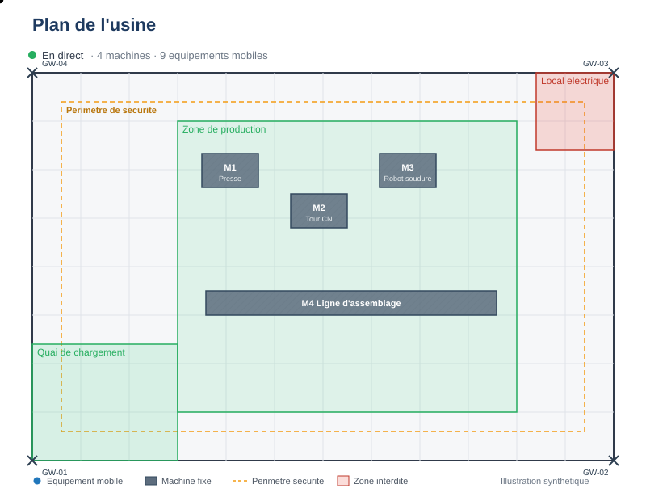

# FactoryTrack — Indoor Asset Tracker (.NET)

[](https://github.com/Arthure-code/factorytrack/actions/workflows/ci.yml)
[](https://github.com/Arthure-code/factorytrack/actions/workflows/codeql.yml)
[](https://sonarcloud.io/summary/new_code?id=arthuredevsecops_factorytrack)
[](https://sonarcloud.io/summary/new_code?id=arthuredevsecops_factorytrack)
[](LICENSE)

Real-time indoor location system (RTLS) for tracking equipment inside a
factory. Built with .NET 9, ASP.NET Core, gRPC, SignalR, PostgreSQL,
TimescaleDB, and .NET MAUI.

> **Personal portfolio project.** The UWB/BLE hardware layer is simulated —
> the simulator produces the RSSI a real gateway would measure, so the whole
> processing pipeline runs on realistic inputs. See [Limitations](#limitations).



<sub>*Synthetic illustration — the tags animate along fabricated trajectories
so the README shows something in motion before a real screen capture is
recorded. Two tags briefly enter the "Local electrique" zone and turn red
to illustrate the forbidden-zone alert. Replace with an actual MAUI capture
(`docs/images/demo.gif`) when available.*</sub>

<details>
<summary><b>Résumé en français</b></summary>

Système de localisation temps réel d'équipements en usine.
Les balises radio sont écoutées par des passerelles fixes ; le back-end
calcule les positions par trilatération à partir des RSSI, les historise dans
TimescaleDB et les diffuse en direct via SignalR à un client .NET MAUI qui
affiche le plan de l'usine, la trace historique de chaque équipement, et les
alertes d'entrée en zone interdite. Le matériel radio est simulé — c'est
l'ensemble de la chaîne logicielle qui est démontré.

</details>

---

## Architecture

Three C4 diagrams live in [`docs/diagrams/`](docs/diagrams/):

- [System context](docs/diagrams/system-context.md) — who uses it and what it
  talks to.
- [Containers](docs/diagrams/containers.md) — services, their tech, how they
  wire up.
- [Position end-to-end sequence](docs/diagrams/sequence-position.md) — from a
  radio emission to a pixel on the operator's screen.

Quick text overview:

```
Balises BLE/UWB ──RSSI──> Passerelles ──gRPC──> Ingestion
                                                    │
                                          idempotence, hors ordre,
                                          fenêtre de regroupement
                                                    │
                                            Positionnement
                                       (RSSI→distance, trilatération, filtrage)
                                                    │
                                    ┌───────────────┴───────────────┐
                                    ▼                               ▼
                          PostgreSQL/TimescaleDB              SignalR Hub
                            (hypertable, agrégats)                  │
                                    │                               ▼
                                    └────REST────────────>    MAUI · Blazor
```

| Service | Role | Port |
|---|---|---|
| `FactoryTrack.Ingestion` | gRPC endpoint, deduplication, position math | 8081 |
| `FactoryTrack.Api` | REST + SignalR hub, silence & zone watchers | 8080 |
| `FactoryTrack.Simulator` | Radio measurement generator | — |
| `FactoryTrack.Mobile` | .NET MAUI client (Android + Windows) | — |
| `timescaledb` | Reference + time series storage | 5432 |

### Projects

- **Domain** — entities, enums, interfaces. No external dependency.
- **Positioning** — trilateration, RSSI→distance, position smoothing.
  Pure code, no infrastructure.
- **Contracts** — `.proto` files and DTOs shared between server and clients.
- **Infrastructure** — EF Core, repositories, reference cache.
- **Mobile** — MAUI, MVVM (CommunityToolkit), SkiaSharp for the floor plan.

---

## Getting started

### With Docker

```bash
git clone <url>
cd factorytrack
docker compose up --build
```

### Without Docker (local dev)

Requires a local PostgreSQL/TimescaleDB accessible on `localhost:5432`
(the compose file works well: `docker compose up timescaledb`).

```bash
dotnet run --project src/FactoryTrack.Api          # http://localhost:8080
dotnet run --project src/FactoryTrack.Ingestion    # http://localhost:8081
dotnet run --project src/FactoryTrack.Simulator    # streams to ingestion
```

Each service has an `appsettings.Development.json` that points at
`localhost` when `ASPNETCORE_ENVIRONMENT=Development`.

### MAUI client

```bash
dotnet build src/FactoryTrack.Mobile -f net9.0-windows10.0.19041.0
./src/FactoryTrack.Mobile/bin/Debug/net9.0-windows10.0.19041.0/win10-x64/FactoryTrack.Mobile.exe
```

Targets: Android (emulator reaches host via `10.0.2.2`) and Windows.

### Sanity check

```bash
curl http://localhost:8080/health
curl http://localhost:8080/api/equipements
curl http://localhost:8080/api/positions/etage/0
```

OpenAPI: `http://localhost:8080/openapi/v1.json`.

### Tests

```bash
dotnet test tests/FactoryTrack.UnitTests           # pure domain, fast
dotnet test tests/FactoryTrack.IntegrationTests    # needs Docker (Testcontainers)
```

---

## MAUI client

What the client does today:

- **Factory floor plan** rendered with SkiaSharp — gateways, zones, and
  equipment moving in real time via SignalR.
- **Uncertainty radius** togglable as a dashed outline (the "Precision"
  switch).
- **Tap on an equipment marker** navigates to a detail page: 30-minute trace
  (gradient polyline), distance travelled, average precision.
- **Red banner** when an equipment enters a forbidden zone; the marker
  itself turns red on the plan for as long as it stays inside. Emitted only
  on transitions — no spam if it stays put.
- **SignalR auto-reconnect** with REST resynchronization: messages missed
  during the outage do not come back on their own.
- **Single `HubConnection` singleton**, injected everywhere — never one per
  page.

Conventions kept: strict MVVM via `CommunityToolkit.Mvvm`
(`[ObservableProperty]`, `[RelayCommand]`), navigation via `Shell` with named
routes, ViewModel injected in the page constructor, centralized styles.

---

## Design choices worth defending

**gRPC in, SignalR out.** gRPC for a dense, binary uplink from constrained
devices; SignalR for pushing to heterogeneous clients with automatic
reconnection. Each has a clear role.

**Idempotency.** A measurement is keyed by `(beacon, gateway, timestamp)`.
The simulator injects 3 % duplicates on purpose to exercise it.

**Out-of-order rejection.** A measurement older than the last processed one
is dropped, not applied — otherwise the equipment would jump backward on
the map.

**Grouping window.** Measurements from the same beacon are accumulated until
all active gateways have reported, or until `FenetreRegroupementMs` expires.
Neither too early (wasted anchors) nor forever (a silent gateway would
block).

**"Last seen" indicator.** Beyond 30 seconds without a measurement, the
equipment is flagged silent. Notification on transition only — showing a
stale position as current is a functional lie.

**Forbidden-zone alerts.** A background service scans the latest positions
every 5 s and emits `AlerteZoneEntree` / `AlerteZoneSortie` only on
transitions. The MAUI client renders that as a banner and a point color
change.

**Precision indicator.** UWB and Bluetooth have different physical
reliability. The estimated precision travels all the way to the UI as an
uncertainty radius.

**Filtering.** Exponential smoothing on the computed position (never on raw
RSSI), with reinforced damping on outliers.

---

## Architecture decisions

ADRs also document *negative* decisions — what we did **not** do and why:

| ADR | Topic |
|---|---|
| [0001](docs/adr/0001-repere-local-en-metres.md) | Local metric coordinates instead of lat/long |
| [0002](docs/adr/0002-pas-de-courtier-de-messages-en-v1.md) | No RabbitMQ in V1 |
| [0003](docs/adr/0003-schema-sql-plutot-que-migrations.md) | SQL schema over EF migrations |
| [0004](docs/adr/0004-calcul-de-position-cote-serveur.md) | Server-side position computation |

---

## Limitations

**What is simulated.** No UWB beacon or physical gateway is used. The
simulator produces the RSSI a real gateway would have measured from a known
position — which in turn allows us to compare the computed position against
ground truth, and inject losses, duplicates, and Gaussian noise at
configurable rates. It is a load-testing tool, not a substitute for
hardware.

**What is still missing.**

- JWT/OIDC authentication (the `DiffuserPosition` hub is open in V1)
- Multi-floor support in the MAUI client (back-end already handles it)
- Blazor WebAssembly client for remote consultation
- Sortable/filterable side panel of equipments
- Performance benchmarks (target: 500 beacons at 2 pos/s)

---

## Security

See [SECURITY.md](SECURITY.md) for the disclosure policy and known limits.

What's active on this repository:

- **Secret scanning + push protection** (GitHub defaults for public repos)
- **Dependabot** weekly updates (NuGet, Docker, GitHub Actions), grouped
  per family to avoid PR noise — see [.github/dependabot.yml](.github/dependabot.yml)
- **CodeQL** static analysis for C# on every push + weekly schedule —
  see [.github/workflows/codeql.yml](.github/workflows/codeql.yml)
- **Trivy** scans Docker images for HIGH/CRITICAL CVEs and blocks the
  pipeline
- **SonarCloud** quality gate + coverage tracked on every push
- **`dotnet list package --vulnerable --include-transitive`** fails the
  build on known CVEs in direct or transitive NuGet deps

## Forking / running your own instance

The CI expects a few things to be set up on your side:

1. Create a **SonarCloud** project (organization + project key).
2. On GitHub → Settings → Secrets and variables → Actions:
   - Add secret `SONAR_TOKEN` (from SonarCloud → My Account → Security)
   - Add repository variable `SONAR_ORGANIZATION`
   - Add repository variable `SONAR_PROJECT_KEY`
3. On GitHub → Settings → Code security:
   - Enable **Push protection** (blocks accidental secret commits)
   - Enable **Dependabot version updates** if not already on
4. On GitHub → Settings → Branches:
   - Add a rule on `main`: require PR + CI passing before merge

The CI skips SonarCloud steps automatically if `SONAR_TOKEN` is missing,
so the workflow won't fail on a fresh fork.

## CI pipelines

Three equivalent pipelines are maintained so this repo demonstrates
comfort with the mainstream CI ecosystems:

- **GitHub Actions** — [.github/workflows/ci.yml](.github/workflows/ci.yml)
  (primary, runs on every push to this repo)
- **Azure DevOps** — [azure-pipelines.yml](azure-pipelines.yml)
  (with ACR push and Azure Container Apps deployment skeleton)
- **GitLab CI** — [.gitlab-ci.yml](.gitlab-ci.yml)

All three build against `FactoryTrack.Server.slnf` (a solution filter
that excludes the MAUI project — its workload isn't installed on Linux
runners) and run OpenCover coverage that SonarCloud reads directly.

## Stack

.NET 9 · ASP.NET Core · gRPC · SignalR · Entity Framework Core ·
PostgreSQL · TimescaleDB · .NET MAUI · SkiaSharp · CommunityToolkit.Mvvm ·
Docker Compose · xUnit · FluentAssertions · Testcontainers · Serilog ·
GitHub Actions · CodeQL · Trivy · SonarCloud · Dependabot ·
Azure DevOps · GitLab CI
