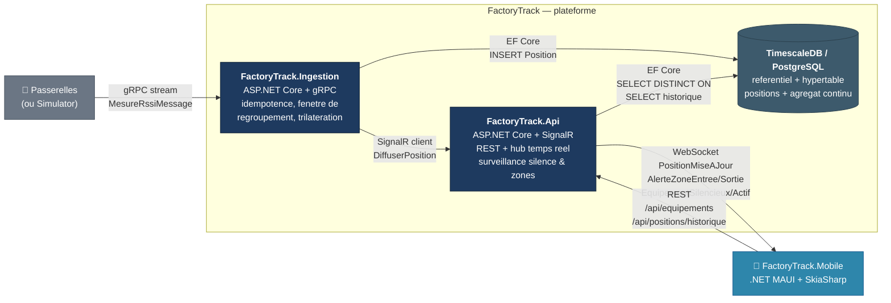

# Containers

Level 2 of the C4 model. Zoom into FactoryTrack : services deployables et leurs
technologies. Le detail interne des classes reste hors scope de cette vue.

## Choix structurants

- **gRPC en entree, SignalR en sortie.** L'ingestion recoit un flux dense et
  binaire ; la diffusion cible des clients heterogenes qui savent gerer
  WebSocket + reconnexion. Chacun a un role distinct.
- **L'ingestion parle a l'API via SignalR client**, pas en processus commun.
  L'API reste la seule proprietaire du hub. Voir ADR 0002.
- **Une seule base**, avec deux natures de tables (referentiel classique +
  hypertable serie temporelle). Pas de segregation lecture/ecriture en V1.
