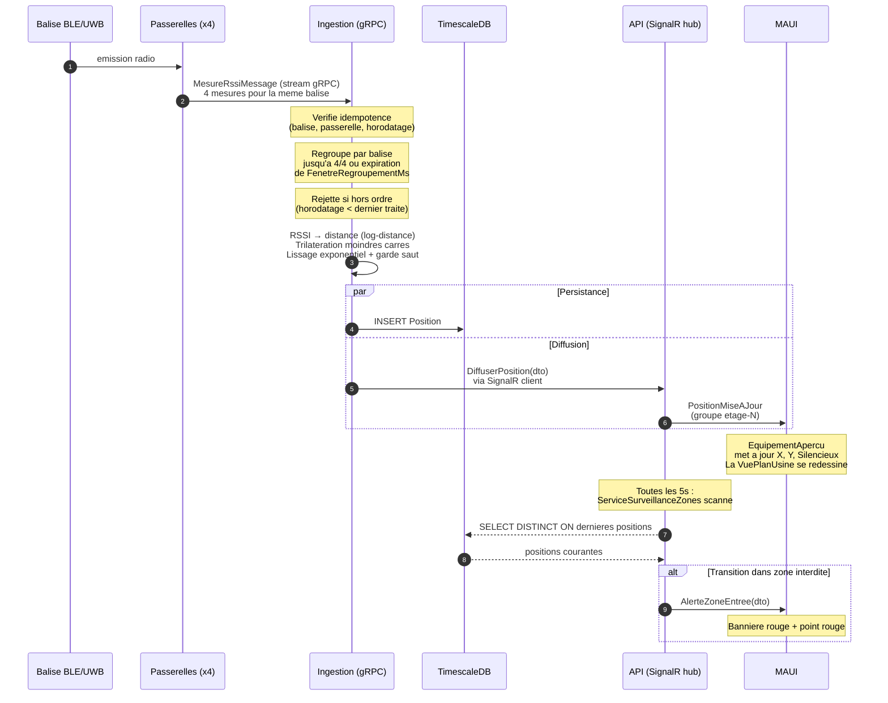

# Sequence : une position bout en bout

Ce que fait le systeme quand une balise emet, depuis l'onde radio jusqu'au pixel
sur l'ecran de l'operateur.

## Points a retenir

- **Une seule position par batch.** L'ingestion attend d'avoir un lot coherent
  avant de trilaterer ; elle ne pousse pas une position par mesure.
- **Persistance et diffusion sont paralleles.** Une panne SignalR n'empeche pas
  le stockage : le hub est reconnectable, la base est autoritative.
- **Les alertes zones sont un processus separe** qui lit l'etat courant en
  base. Le calcul de position n'a pas a savoir ou sont les zones.
