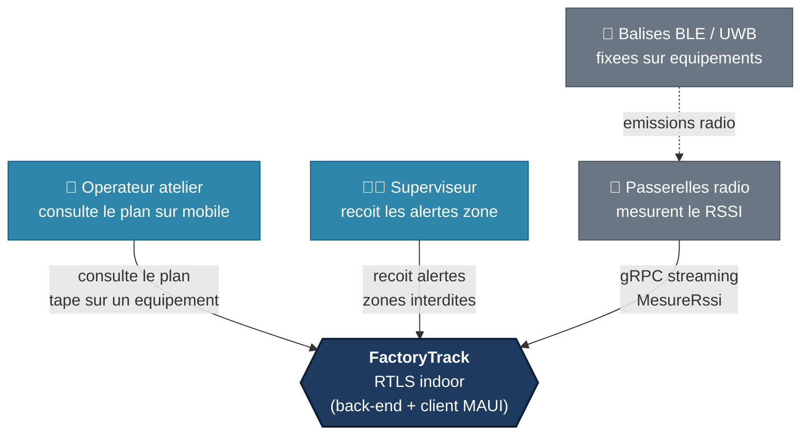

# System context

Level 1 of the C4 model. Answers the question "who uses this and what does it
talk to?" without exposing internals.

## Ce que le systeme ne fait PAS

- Il n'ecoute pas les ondes radio lui-meme : ce sont les passerelles qui
  captent, FactoryTrack recoit un flux de mesures deja numerisees.
- Il ne pilote pas les equipements : il les localise, un autre systeme decide.
- Il ne gere pas l'authentification en V1 : voir README > Limitations.
